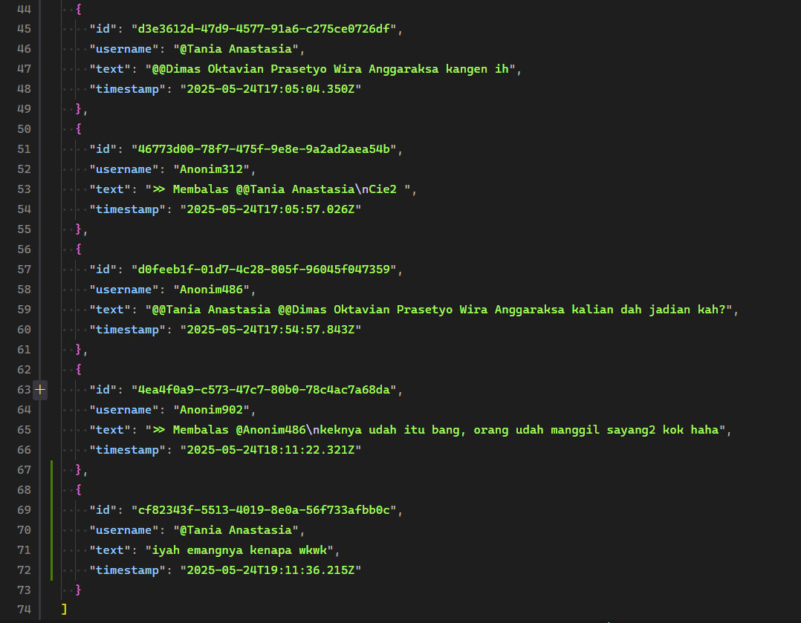
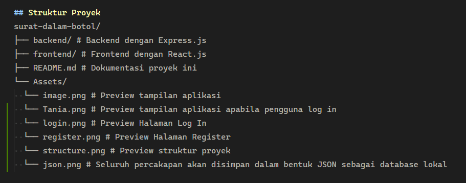

# Surat dalam Botol

## Preview Tampilan

---

## Deskripsi Proyek

**Surat dalam Botol** adalah aplikasi chat anonim yang dikembangkan untuk memenuhi technical test posisi Back-end Developer Intern di PT Farma Global Teknologi, Yogyakarta (Farmagitechs) sebagai seleksi lanjutan dari wawancara yang telah dilakukan pada kurang lebih 1 minggu yang lalu. Aplikasi ini memungkinkan pengguna untuk mengirim dan melihat pesan-pesan sederhana yang telah dikirimkan oleh pengguna lain secara anonim, tanpa harus memiliki akun.

Backend aplikasi ini dibangun menggunakan **Express.js**, sementara frontend menggunakan **React.js** sebagai framework utama.

---

## Fitur Utama

- **Pengiriman dan penerimaan pesan anonim**
  Pengguna dapat mengirim pesan tanpa harus login atau membuat akun, serta dapat melihat daftar pesan yang telah dikirim oleh pengguna lain.

- **Tiga Endpoint API di Backend:**
  1. **GET** /messages — Mengambil daftar pesan yang tersedia
  2. **POST** /messages — Mengirim pesan baru
  3. **DELETE** /messages/:id — Menghapus pesan berdasarkan ID

- **Fitur tambahan akun (opsional)**
  Jika waktu memungkinkan, ditambahkan fitur login dan registrasi menggunakan password yang disimpan aman dengan hashing berbasis **bcrypt** untuk menjaga keamanan data pengguna.

---

## Proses Pengembangan

- **Backend**
  - Menggunakan framework Express.js untuk membuat API dengan endpoint yang sesuai kebutuhan.
  - Melakukan pengujian API secara menyeluruh menggunakan **Postman** sebelum implementasi frontend, memastikan response JSON rapi dan struktur data terorganisir.
  - Mengimplementasikan fitur login dan register dengan hashing password menggunakan **bcrypt** untuk keamanan optimal.

- **Frontend**
  - Dibangun menggunakan React.js agar tampilan interaktif dan responsif.
  - UI dibuat sederhana namun fungsional, memudahkan pengguna mengirim dan melihat pesan dengan mudah dan cepat.

---

## Struktur Proyek

---

## Fitur Utama

- **Pengiriman dan penerimaan pesan anonim**
  Pengguna dapat mengirim pesan tanpa login dan melihat daftar pesan.
- **Login dan Registrasi Akun**
  Pengguna dapat membuat akun dan masuk menggunakan username dan password yang aman, di mana password di-hash menggunakan **bcrypt** untuk menjaga keamanan data.
- **Reply Pesan**
  Pengguna dapat membalas pesan yang sudah ada, sehingga tercipta percakapan yang terstruktur meskipun tetap anonim.
- **Penghapusan dan Edit Pesan**
  Pengguna dapat menghapus atau mengedit pesan yang telah dikirim.
- **Mention**
Pengguna dapat mengirim pesan dengan tag pengguna lain, sehingga pengguna tersebut akan melihat untuk siapa pesan tersebut ditujukan.

- **Tiga Endpoint API utama**:
  1. **GET** /messages — Mengambil daftar pesan dan reply-nya
  2. **POST** /messages — Mengirim pesan baru
  3. **DELETE** /messages/:id — Menghapus pesan berdasarkan ID
  4. **POST** /auth/register — Registrasi user baru
  5. **POST** /auth/login — Login user

---

## Penutup

Pengerjaan proyek ini tidak hanya sebagai bukti kemampuan teknikal saya dalam mengembangkan aplikasi full-stack secara profesional, tetapi juga sebagai proses pembelajaran dan pengembangan diri. Saya percaya setiap baris kode yang saya tulis bukan hanya soal teknologi, tapi juga tentang bagaimana solusi sederhana dapat menyatukan orang-orang, walau hanya lewat pesan anonim.

Semoga aplikasi **Surat dalam Botol** ini bisa menjadi inspirasi dan bukti bahwa teknologi dapat menjadi jembatan komunikasi tanpa batas, sekaligus membuka peluang baru untuk pengembangan kemampuan saya dan kontribusi saya di dunia software development.

Teruslah berkarya, teruslah belajar — karena setiap usaha dan ketekunan akan membuahkan hasil yang tak ternilai.

---

**Dimas Juniors**
Back-end Developer Intern Candidate
PT Farma Global Teknologi, Yogyakarta

